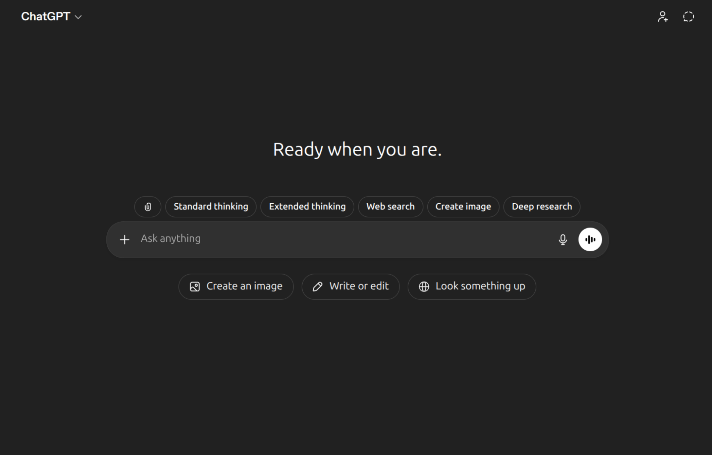

# ChatGPT Shortcut Buttons



A browser extension that pins shortcut buttons next to ChatGPT's chat box — so you don't have to dig through its ever-changing menus to find Web search, Image, Deep research, Standard / Extended thinking, Agent mode, Add sources, Canvas, Quizzes, or file upload.

## Install

Download `chat-gpt-buttons-X.X.zip` from the repo, then follow the steps for your browser.

### Chrome / Edge / Brave / Opera

1. Open the extensions page:
   - Chrome — `chrome://extensions`
   - Edge — `edge://extensions`
   - Brave — `brave://extensions`
   - Opera — `opera://extensions`
2. Toggle **Developer mode** on (top-right).
3. Drag `chat-gpt-buttons-X.X.zip` onto the page.

### Firefox

1. Open `about:debugging#/runtime/this-firefox`.
2. Click **Load Temporary Add-on…** and pick `chat-gpt-buttons-X.X.zip`.

Temporary loads are cleared when Firefox restarts. For a permanent local install, the extension needs to be signed through [addons.mozilla.org](https://addons.mozilla.org).

Requires Firefox 109 or later (Manifest V3 support).

### Safari

Safari extensions need to be wrapped as a macOS app. On a Mac with Xcode installed:

```sh
xcrun safari-web-extension-converter /path/to/chat-gpt-buttons
```

This produces an Xcode project. Build and run it once, then enable the extension in **Safari → Settings → Extensions**.

Requires macOS 13+ / Safari 16.4+.

## Use

After installing, visit [chatgpt.com](https://chatgpt.com). A row of pill buttons appears above the chat box. Each pill mirrors a ChatGPT feature that's normally buried in the `+` menu, the model switcher, or the file upload picker.

Click the toolbar icon to:

- Toggle the whole extension on/off (master switch — on by default).
- Pick which individual buttons to show. Settings sync via `chrome.storage.sync`.

## Files

- `manifest.json` — Manifest V3 with a Gecko block for Firefox.
- `content.js` — DOM injection, pill state sync, master enable/disable.
- `pills.js` — single source of truth for pill keys, labels, and default visibility (loaded into both the content script and the popup).
- `popup.html` / `popup.js` — extension toolbar popup.
- `icons/` — toolbar / extensions-page / store icons at 16, 32, 48, 128 px.
